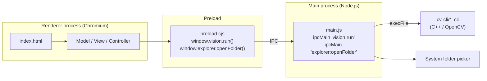
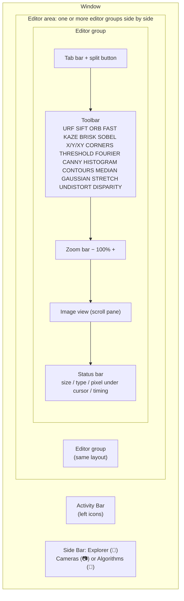
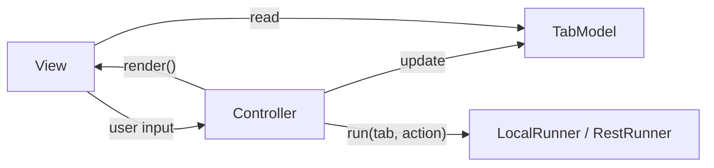
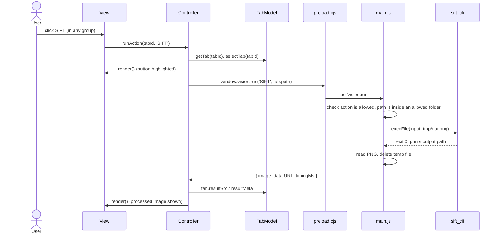
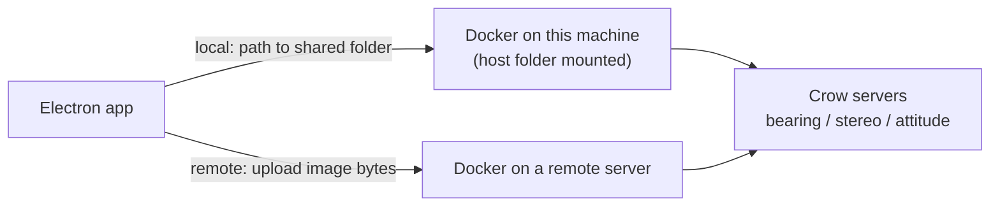

# Design

An Electron desktop app for viewing images and running OpenCV processing on them (SIFT, ORB, Sobel, corners, ...). It's a proof of concept, kept deliberately simple: plain JavaScript (no framework, no bundler) in the UI, C++/OpenCV for the image processing.

## Project layout

```
hello-world/
├── main.js            Electron main process: creates the window, folder picker, spec lists, runs the cv-cli tools
├── preload.cjs        Bridge exposing window.vision, window.explorer and window.specs to the page
├── index.html         Page markup, styles, and the setup code that connects model/view/controller
├── Data.js            Models: TabModel, SideBarModel, ExplorerModel, SpecModel
├── View.js            View: draws the model, forwards clicks to the controller
├── Controller.js      Controller + runners (LocalRunner, RestRunner)
├── img/               Images the app is allowed to process
├── camera_spec/       One JSON file per camera, shown in the Cameras side bar
├── algo_spec/         One JSON file per algorithm, shown in the Algorithms side bar
├── elements/          One JSON file per workflow element (source, transform, sink), shown in the Workflow palette
├── cv-cli/            One small command-line tool per toolbar action
│   ├── cpp-sift/      sift_cli.cpp + CMakeLists.txt  (same pattern in each folder)
│   ├── cpp-surf/  cpp-orb/  cpp-fast/  cpp-kaze/  cpp-brisk/
│   ├── cpp-sobel/     sobel_cli (x | y | xy mode argument)
│   └── cpp-corners/
├── cpp-lib/           navlib: C++ library + future REST servers
│   ├── CMakeLists.txt
│   ├── common/        Shared OpenCV/Eigen code; every vertical links against it
│   ├── bearing/  stereo/  attitude/   Verticals: include/ src/ test/ example/ server/
│   └── docker/        Dockerfile, build.sh, push.sh (dev container image)
└── .vscode/launch.json  Debug configs for the main and renderer processes
```

## Processes

Electron runs two processes. The page (renderer) is sandboxed and cannot start programs or read arbitrary files; only the main process can. The preload script is the single, narrow door between them.



## UI structure



### Explorer

The left strip of icons is the **Activity Bar** (VS Code's name; also called a navigation rail). Each icon opens a view in the **Side Bar**; only one view shows at a time, and clicking the open view's icon again closes the side bar. `SideBarModel.activeView` records which one is open. The top button (📁) opens the **Explorer**:

- **Open Folder…** shows the system folder picker (run by the main process with `dialog.showOpenDialog`).
- The main process recursively scans the selected folder and lists only supported images (`.png`, `.jpg`, `.jpeg`, `.bmp`, `.webp`). The returned tree preserves camera-rig directories such as `Cam1/`, `Cam2/`, and `CamN/`; non-image files and directories with no images anywhere below them are omitted. Image nodes include their name, disk path, and `file://` URL.
- Clicking an image opens it in a new tab in the focused group. If that group already has it open, it switches to that tab instead. The file shown in the focused group is highlighted.
- Icons: a folder icon for the opened folder, and a picture icon per image coloured by type (PNG purple, JPEG orange, BMP blue, WebP green). They're small inline SVGs defined in `ICON_SHAPES` in [View.js](View.js), coloured by the `.icon-*` classes in `index.html`.
- TIFF isn't listed because Chromium can't display it; showing it would need a conversion step (e.g. a small cv-cli tool that writes a PNG).

### Cameras and Algorithms

Two Activity Bar buttons show **spec trees**: 📷 **Cameras** (from `camera_spec/`) and 🧩 **Algorithms** (from `algo_spec/`). Both work the same way and share one `SpecModel` class and one tree renderer.

- **One JSON file per camera or algorithm.** To add one, drop in another `.json` file and click ⟳ in the view's header.
- The main process reads the folder (`specs:list`). The page passes only a kind name, `cameras` or `algorithms`; anything else is rejected, so it can't reach any other path. The list is loaded the first time each view opens. A file that isn't valid JSON shows as a red "invalid JSON" row instead of hiding the others.
- The tree is drawn generically from the JSON, so any new field appears without code changes. Objects and longer arrays expand; short arrays of plain values (e.g. a matrix row) show on one line; collapsed objects show a short preview; `null` (unknown) shows as `—`. Entries of an array that have a `name` are labelled by it rather than by index. Expanded nodes are remembered in `SpecModel.expanded` by path (e.g. `simple_binocular_stereo.json/inputs/0`).

#### Camera files (`camera_spec/`)

| File | Camera |
|---|---|
| `bfly_pge_13s2m_cs.json` | Blackfly BFLY-PGE-13S2M-CS, serial 17426948, with the 12 mm f/1.4 lens and nominal (uncalibrated) intrinsics |
| `see3cam_cu30_chl_tc.json` | See3CAM_CU30_CHL_TC (Type-C board, AR0330HS), with video modes |
| `see3cam_cu30_chl_l_th_bx.json` | See3CAM_CU30_CHL_L_TH_BX (exact suffix not in the public catalog; CU30 family values) |

File layout (all cameras use the same top-level keys; unknown values are `null`, never guessed):

| Key | Contents |
|---|---|
| `schemaVersion`, `id`, `name`, `manufacturer`, `model`, `serialNumber` | Identity. `partNumberOnUnit` is the label as printed, when it differs from `model`. |
| `sensor` | Sensor model, technology, chroma, optical format, `resolution`, `pixelPitchUm`, `activeAreaMm`, shutter, bit depth, dynamic range, SNR, noise, spectral notes. |
| `interface`, `lensMount`, `output`, `hardwareTrigger`, `isp` | Connection, mount, formats/frame rates/video modes, trigger, on-camera processing. |
| `lens` | Fitted lens: focal length, aperture, derived field of view. `null` when the lens isn't known. |
| `intrinsics` | Camera matrix `K`, `fx`, `fy`, `cx`, `cy`, `distortion`. `calibrated: false` means values are theoretical. |
| `notes`, `openQuestions`, `sources` | Caveats, things still to confirm, and where the data came from. |

Each camera file can be opened directly in an editor tab from the Cameras sidebar by clicking its title, double-clicking its row, or clicking the edit button (`Open in tab`). In the editor tab, the JSON content can be edited, formatted with 2-space indentation, reverted, and saved to disk via `💾 Save` or `Cmd+S` / `Ctrl+S`. Saving validates JSON syntax, writes directly to `camera_spec/`, and automatically reloads the spec models across the application.

#### Algorithm files (`algo_spec/`)

Each file describes one visual-navigation algorithm's interface: what it takes in and what it produces. Current file: `simple_binocular_stereo.json`.

| Key | Contents |
|---|---|
| `schemaVersion`, `id`, `name`, `vertical`, `summary` | Identity. `vertical` matches the `cpp-lib/` folders (`stereo`, `bearing`, `attitude`). |
| `inputs` | Named entries, each with `type` (`image`, `camera`, …), `required` and `description`. A `camera` input lists its `fields` (`K`, `D`, `T`). |
| `parameters` | Tuning values (thresholds, ranges). Empty until defined. |
| `outputs` | Named results with types, e.g. `point3d`, `z`. |
| `telemetry` | Intermediate data worth surfacing, e.g. `detects`, `matches`. |
| `openQuestions` | Things still to pin down. |

Inputs, outputs and telemetry are **arrays of named entries** rather than objects. In the original mock, `input` held two `"image"` keys and both a `"camera"` and a `"Camera"` key; duplicate keys in JSON silently discard all but the last, so the left image and one camera would have been lost.

### Workflow

The Activity Bar's workflow button (below 6-DoF) opens an image-processing **workflow editor**, a node graph in the spirit of Lucidchart:

```
|source| -> |transform| -> |transform| -> |sink|
                 |              |
               telem          telem
```

- **Palette (side bar):** lists `elements/`, one file per element, grouped into Sources, Transforms and Sinks, each with its own colour. Files that don't parse or lack `kind` show as red rows. ⟳ reloads the folder.
- **Canvas (editor tab):** a workflow tab has `type: 'workflow'` and holds a `graph` instead of an image, so it has no image toolbar or zoom bar. Opening the Workflow view creates one if none exists; **New Workflow** adds more. **Open Workflow** opens a saved graph in a new tab. Workflow tabs split, move and close like image tabs.
- **Nodes:** drag an element from the palette onto the canvas to add a node at the drop point. Drag a node by its header to move it; ✕ removes it. Inputs are on the left, outputs on the right, telemetry along the bottom.
- A node copies its element's ports and parameter defaults when created, so a graph stays drawable if `elements/` changes later.
- **Connections:** drag from any port to a port on another node (either direction works). While dragging, ports that can accept the connection are highlighted and the rest are dimmed; releasing anywhere else cancels. Wires are bezier curves in an SVG layer under the nodes, measured from the port dots so they follow nodes as they move. Telemetry wires leave downward and are dashed purple.
- **Removing a connection:** click it to select it, then press Delete/Backspace or click the ✕ at its midpoint. Escape or clicking empty canvas deselects. Removing a node removes its connections.

Connection rules (enforced in `TabModel.canConnectWorkflow`, which the view also uses for highlighting):

| Rule | Why |
|---|---|
| Output or telemetry port → input port | Data flows one way. |
| Port types must match (`any` matches everything) | E.g. an `image` output can only feed an `image` input. |
| No connection from a node to itself, and no loops | A workflow must be runnable in order, source to sink. |
| An input takes one connection; connecting to an occupied input replaces it | Each input has exactly one producer. An output can feed many inputs. |
| Exception: **sink** inputs accept any number of connections | A sink can collect several streams, e.g. save the source, the blurred and the edge images. |
| The same output can't be connected to the same input twice | A duplicate wire would do nothing but double the work. |

Each edge is stored as `{ id, from: { nodeId, port, direction }, to: { nodeId, port } }` in `tab.graph.edges`.

**Save/Load:** **Save** and **Save As** are on the workflow status bar; `Cmd/Ctrl+S` saves and `Cmd/Ctrl+Shift+S` opens Save As. Open/Save use native dialogs. Files use versioned JSON with `format: "navlib-workflow"` and `schemaVersion: 1`; they store the name, node IDs/element IDs/names/parameters/positions, and edges. Ports are rebuilt from the current `elements/` catalog when opened, so a document never chooses what executable or ports are trusted. The default Save As location is `<resultsDir>/workflows/`. Existing local folder/file parameters are preserved, but opening the document does not grant filesystem access; the app warns if paths must be reselected. Saving is atomic. Unsupported versions, oversized files, unknown elements, invalid parameter values, invalid edges, and cycles are rejected.

Node parameters and workflow execution are implemented; persistence now covers opening, saving, and saving a copy.

#### Element files (`elements/`)

```json
{
  "schemaVersion": 1,
  "id": "gaussian",
  "name": "Gaussian",
  "kind": "transform",
  "icon": "transform",
  "summary": "Gaussian blur.",
  "inputs":  [{ "name": "image", "type": "image" }],
  "outputs": [{ "name": "image", "type": "image" }],
  "params": { "kernel_size": { "type": "number", "default": 5 } },
  "telemetry": []
}
```

| Key | Contents |
|---|---|
| `kind` | Structural role: `source` (no inputs), `transform`, or `sink` (no outputs). Decides the node colour and whether an input accepts several connections. |
| `category` | Palette section: `source`, `filter`, `feature`, `stereo`, `flow`, `sink`. A new category gets its own section automatically. Defaults from `kind`. |
| `icon` | One of the built-in icon names (`camera`, `folder`, `image`, `transform`, `storage`); otherwise the kind's default icon. |
| `inputs`, `outputs`, `telemetry` | Named, typed ports. Port types (e.g. `image`) will decide which ports may be connected. |
| `params` | Each parameter has a `type` and a `default`; new nodes start with the defaults. `enum` parameters list their `options`. |
| `exec` | How the node runs: `{ "cli": "<tool under cv-cli/>", "args": [...] }` or `{ "builtin": "<name>" }`. Missing means "not runnable yet" (shown in the palette tooltip). |

Current elements, by category: Sources — Camera, Image Directory, Single Image, Synthetic Camera; Filters — Canny, Contours, Convert, Gaussian, Median, Sobel, Stretch Contrast, Threshold; Features — BRISK, Corners, FAST, KAZE, ORB, SIFT, SURF; Analysis — Fourier, Histogram; Stereo & Geometry — Disparity, Remap, Simple Stereo, Undistort; Flow — Splitter; Sinks — Save to Directory.

Every CLI tool now has a matching element. Only SIFT emits structured data (a `keypoints` port); the other detectors output an annotated `preview` image, so downstream nodes get a picture rather than feature data. Fourier and Histogram are derived views, not in-place filters, so their outputs are named `spectrum` and `chart`.

#### Typed ports: one model for splitting, merging and keypoints

Elements don't need special kinds for splitting, merging or producing non-image data. Every node is described by its typed ports:

| Behaviour | Expressed as |
|---|---|
| Split into parallel branches | Fan-out: one output can feed any number of inputs. The Splitter element is optional, a visual marker that passes its input to outputs `a` and `b`. |
| Merge / collapse (e.g. Disparity) | A node with several inputs (`left`, `right`) and one output. |
| Produce keypoints (SIFT, corners, …) | An output of type `keypoints`, which only connects to inputs that accept keypoints. Feature elements also output an annotated `preview` image. |
| Future: matching, simple stereo | `keypoints` × 2 → `matches`; `matches` + cameras → `pointcloud`. |

Port types live in `PORT_TYPES` in [Data.js](Data.js), each naming the type it extends:

| Type | Extends | File format when run |
|---|---|---|
| `image` | — | PNG |
| `disparity` | `image` | PNG (so it can be saved or viewed like an image) |
| `keypoints` | — | JSON: `{ type, detector, image: {width, height}, count, keypoints: [{x, y, size, angle, response, octave}] }` |
| `matches` | — | JSON (planned) |
| `pointcloud` | — | PLY (planned) |

An output can feed an input of the same type or of any type it extends; `any` matches everything. Port dots are coloured by type on the canvas. Adding a data type means one entry in `PORT_TYPES` and one CSS colour.

#### Running a workflow (planned)

Workflows run by chaining the existing command-line tools, using files to hand data between them:

1. **Order the nodes.** Loops are forbidden, so the graph always sorts topologically.
2. **Allocate a temp file per output port**, with the extension its type needs (above).
3. **Run each node in order.** For a `cli` node, fill its `args` template — `{in.<port>}` with the upstream file, `{out.<port>}` with its own file, `{param.<name>}` with the node's parameter — and call it with `execFile`. `builtin` nodes are handled by the runner: `dir_source`/`single_image`/`sync_camera_source` emit files, `passthrough` reuses its input file, `save_to_dir` copies inputs to the destination.
4. **Per frame.** A directory source emits one file per frame and the graph runs once per frame. Several sources (e.g. rig folders `Cam1/`, `Cam2/`) are paired by file name.

Security: the page sends only the graph (element ids, parameter values, connections). The main process loads each element's `exec` from `elements/` itself, rejects tools outside `cv-cli/`, checks parameters against their declared types, and checks every path against the allowed folders. The page never supplies a command.

Tool changes this needs: `sift_cli` already takes an optional third argument, a keypoints JSON path (`sift_cli <in> <preview> [keypoints.json]`); the other feature tools should follow the same pattern. Gaussian and Disparity need tools before they can run.

### Editor groups

Like VS Code's split editors, the editor area holds one or more **editor groups** side by side. Each group has its own tab bar and shows its own active tab.

- **Split:** the split button (◫) on a tab bar opens a copy of that group's active tab in a new group to its right.
- **Drag a tab** onto another tab (left half = before it, right half = after it) or onto a tab bar to move it there. Dragging within one tab bar reorders.
- **Drop zones on the image area:** dropping a tab on the left or right quarter of a group's content opens it in a new group on that side; the highlighted half shows where it will go. Dropping in the middle moves it into that group.
- **Resize:** drag the divider ("sash") between two groups. Each group has a `size` weight; a new split takes half of its neighbour's weight, and a closed group gives its weight to a neighbour, so other groups keep their width. Groups can't be dragged narrower than 120px. While dragging, only the two groups' styles change; the model is updated once on release.
- **Focus:** the focused group's active tab has a blue top border; other groups' active tabs have a grey one.
- **Closing:** a group disappears when its last tab is closed or dragged away, except the last remaining group.
- Only tabs from this app can be dropped: drags use a custom data type (`application/x-editor-tab`), so text or files dragged in from elsewhere are ignored.

Not yet supported: top/bottom splits. That needs the flat list of groups replaced by a layout tree (rows and columns nested inside each other).

## MVC

| Class | File | Responsibility | Knows about |
|---|---|---|---|
| `TabModel` | [Data.js](Data.js) | Editor groups and their tabs, active group and tab, zoom limits; add/select/close/move/split rules. No screen code, so it can be tested in plain Node. | nothing |
| `ExplorerModel` | [Data.js](Data.js) | The opened folder and its image list. | nothing |
| `SideBarModel` | [Data.js](Data.js) | Which side bar view is open (`'explorer'`, `'cameras'` or none). | nothing |
| `SpecModel` | [Data.js](Data.js) | One folder of JSON specs (`camera_spec/` or `algo_spec/`) and which tree nodes are expanded. Instantiated once per spec kind. | nothing |
| `View` | [View.js](View.js) | Draws the side bar and each group on screen, handles tab drag-and-drop; sends every click and drop to the controller. Never changes the models. | models (read-only), controller |
| `Controller` | [Controller.js](Controller.js) | Handles user actions: `toggleSideBarView`, `openFolder`, `openImage`, `reloadSpecs`, `toggleSpecNode`, `selectTab`, `closeTab`, `setZoom`, `moveTab`, `splitGroup`, `splitWithTab`, `resizeGroups`, `runAction(tabId, action)`. Updates the models, then calls `view.render()`. | models, view, runner |



Setup order in `index.html`: create the model, then the view, then the controller (which gets the view), then `view.setController(controller)`, then `view.render()`. The view and controller each need a reference to the other, which is why the link is finished in two steps.

Rendering is "redraw everything from the model": after any change the controller calls `view.render()`, which rebuilds every group from scratch. Simple and fast enough for a handful of tabs.

### Tab data

`TabModel` holds `groups` (left to right) and `activeGroupId`. Each group is `{ id, tabs: [], activeTabId }`, and each tab looks like:

```js
{
  id,             // crypto.randomUUID()
  label,          // shown on the tab, e.g. 'one.png'
  src,            // URL the  displays: 'img/one.png' or a file:// URL from the Explorer
  path,           // file on disk the vision tools process (defaults to src for bundled images)
  pixelType,      // placeholder 'CV_8UC3' until real detection exists
  zoom,           // percent, 25..400
  activeAction,   // last toolbar action, e.g. 'SIFT'
  resultSrc,      // processed image (data: URL), shown instead of src when set
  resultMeta,     // { timingMs } from the last run
  serviceError    // error message from the last run, shown in the status bar
}
```

## Running a vision action

Local vs. remote processing is chosen by which **runner** the controller is given, not by if/else. Both runners have the same `run(tab, action)` method and return `{ image, timingMs }`.

| Runner | How it works | Status |
|---|---|---|
| `LocalRunner` | Page → preload → `main.js` → `execFile` of a `cv-cli` tool on this machine | Working |
| `RestRunner` | `fetch` POST to a Crow REST server, uploading the image bytes | Stub; no server yet |

Switch with `controller.setRunner(new RestRunner('http://localhost:8080'))`.



### Security rules in `main.js`

- **Allowed actions only.** `CLI_ACTIONS` maps each toolbar label to one executable and its fixed arguments. Anything else is rejected.
- **Allowed images only.** The image path must be inside `img/` or a folder the user picked with **Open Folder…**. The main process keeps that list itself; the page can't add to it, so it can't point the tools at an arbitrary file. The check uses `path.relative`, so look-alike folders (`Pictures2` vs `Pictures`) and `..` tricks are rejected.
- **No shell.** Tools are started with `execFile`, so an image path is always a plain argument and can never be run as a command.
- **Time limit.** Each tool run is killed after 60 seconds.

## Command-line tools (`cv-cli/`)

Every tool follows the same pattern as the original `sobel_cli`:

```
<tool>_cli <input_image> <output_image> [extra args]
```

| Exit code | Meaning |
|---|---|
| 0 | Success; output path printed to stdout |
| 1 | Bad arguments |
| 2 | Couldn't read input image |
| 3 | Couldn't write output image |
| 4 | SURF only: OpenCV built without nonfree support |

| Toolbar | Tool | Notes |
|---|---|---|
| URF | `surf_cli` | SURF; needs OpenCV contrib built with `OPENCV_ENABLE_NONFREE`. hessianThreshold, nOctaves, nOctaveLayers |
| SIFT | `sift_cli` | nfeatures, nOctaveLayers, contrastThreshold, edgeThreshold, sigma |
| ORB | `orb_cli` | nfeatures, scaleFactor, nlevels, fastThreshold |
| FAST | `fast_cli` | threshold, nonmaxSuppression |
| KAZE | `kaze_cli` | threshold, nOctaves, nOctaveLayers |
| BRISK | `brisk_cli` | thresh, octaves, patternScale |
| SOBEL X / Y / XY | `sobel_cli` | axis fixed by the button, plus ksize |
| CORNERS | `corners_cli` | Shi-Tomasi: maxCorners, qualityLevel, minDistance, blockSize |
| THRESHOLD | `threshold_cli` | Range thresholding: zero outside `[low, high]`; optionally replace pixels inside the range with `bandValue` |
| FOURIER | `fourier_cli` | Log-scaled 2D grayscale DFT magnitude spectrum, shifted so low frequencies appear at the centre. No parameters |
| CANNY | `canny_cli` | low, high, apertureSize, l2gradient |
| HISTOGRAM | `histogram_cli` | Rendered grayscale intensity histogram; bins |
| CONTOURS | `contours_cli` | Contours from Canny edges: low, high, thickness, externalOnly |
| MEDIAN | `median_cli` | Median blur; dialog asks for an odd `ksize` 3–31 (default 5) |
| GAUSSIAN | `gaussian_cli` | Gaussian blur; odd `ksize` 1–31 plus `sigmaX`/`sigmaY`, where 0 lets OpenCV derive the sigma |
| STRETCH | `stretch_cli` | Contrast stretch (auto-levels); `percentile`, `minmax` or `bits` mode. Reads 16-bit input unchanged and writes 8-bit |
| UNDISTORT | `undistort_cli` | `cv::undistort` with camera matrix and distortion coefficients from a dialog, optionally filled from a camera spec |
| REMAP | `remap_cli` | `cv::remap` with coordinate maps (XML/YAML/EXR or presets: `identity`, `flip_h`, `flip_v`, `flip_hv`). Pre-generated maps reside in `img/` and `maps/` |
| CONVERT | `convert_cli` | Converts color channels (gray, rgb), bit depth (u8, u16 with clean 255/65535 scaling), and resizes with aspect ratio preservation (black borders) |

The tools return a finished image with results drawn on it, so the Electron side needs no C++ or OpenCV of its own.

Build one tool:

```
cmake -S cv-cli/cpp-sift -B cv-cli/cpp-sift/build
cmake --build cv-cli/cpp-sift/build
```

`main.js` expects each executable at `cv-cli/cpp-<name>/build/<name>_cli`.

To add a new action: create `cv-cli/cpp-<name>/` following the same pattern, add an entry to `CLI_ACTIONS` in `main.js`, and add the label to `TOOLBAR_ACTIONS` in `index.html`.

Actions with parameters are declared once, in `CLI_ACTIONS` in `main.js`. Each entry lists its parameters with a type, label, default and range:

| Type | Meaning |
|---|---|
| `number` | any value within `[min, max]` |
| `integer` | whole numbers only |
| `odd` | whole and odd, as several OpenCV kernels require |
| `boolean` | passed to the tool as `1` or `0` |
| `enum` | one of `values` |

That single declaration drives three things, so a parameter is never described twice:

1. **The dialog.** The page fetches the declarations with `window.vision.actions()` and `View.showActionDialog` builds the form from them: number inputs, checkboxes or selects, with a Defaults button. Edited values are remembered per action for the session.
2. **Validation.** `buildArgs` in `main.js` checks each value against the same declaration before it becomes an argument, so the page can never pass an unexpected string to a tool. A missing value falls back to the declared default rather than failing.
3. **Argument order.** Parameters are passed in declaration order, after any `fixed` arguments (the Sobel buttons pass their axis this way, and SIFT passes an empty keypoints path).

To add a parameter to a tool: accept it in the C++ using the helpers in `cv-cli/common/cli_args.hpp`, add one line to that action's `params` in `main.js`, and add it to the matching file in `elements/`. No dialog code is involved.

Three dialogs remain hand-written because their fields are conditional or come from elsewhere: `STRETCH` (fields depend on the chosen mode), `UNDISTORT` (prefilled from a camera spec) and `DISPARITY` (needs a second image and matrix editors).

### Workflow node parameters

Each node on the canvas has a gear button in its header that opens the same form. The only difference is where the pieces come from:

| | Toolbar action | Workflow node |
|---|---|---|
| Declarations | `CLI_ACTIONS` in `main.js` | the element file's `params` |
| Current values | remembered per action for the session | stored on the node in `graph.nodes[].params` |
| On apply | runs the tool | saves to the node |

`View.showSchemaDialog` builds the form; `showActionDialog` and `showNodeParamsDialog` are thin callers. `View.elementParamSpecs` converts an element's `params` object into the array the form expects, mapping `boolean` to a checkbox, `enum` to a select (accepting either `values` or `options`), `camera` to a list of the camera specs, `folder` and `file`/`path` to a read-only box with a **Browse…** button, and everything else to a number input. An element with no parameters still opens, and says so.

Folder and file parameters cannot be typed into. The value must come from the system chooser, because choosing it is what adds it to `allowedFolders` — the same gate the toolbar uses. A sink's folder parameter sets `"create": true`, which lets the chooser make a new folder.

Node parameters default from the element file when the node is created, so a node is always runnable without opening the dialog.

### Workflow runs and the artifact convention

Steps pass data as files. Every tool is already a separate process that reads a file and writes a file, so the graph's edges become paths rather than anything held in memory. That also makes a run inspectable after the fact: the intermediates are still on disk, can be reopened in a tab, and can be compared between runs.

`app.json` in the project root holds the settings:

```json
{ "resultsDir": "~/data/navlib", "toolTimeoutMs": 60000 }
```

`resultsDir` accepts `~` and a relative path is taken from the project folder. A missing or malformed `app.json` falls back to the defaults above, with a warning for the malformed case. Below it:

```
<resultsDir>/runs/<workflow>/<run>/frames/NNNN/NN_<node>__<port>.<ext>
<resultsDir>/scratch/session-<pid>/       toolbar output
```

**Runs are kept.** Only `scratch`, which holds one-off toolbar results, is deleted when the app quits — otherwise the record a run exists to provide would vanish with it.

- **workflow** — the tab's name, slugged. Double-click a tab to rename it. Workflow names are kept distinct (a clash gets a numeric suffix) because the name becomes a folder.
- **run** — an ISO timestamp, so re-running never overwrites earlier results.
- **NN** — execution order, so the folder reads top to bottom in the order the graph ran.
- **node and port** — the file is named after what *produced* it. An edge is identified by where the data came from, not where it goes, which matters because a node can have several outputs (SIFT writes `__keypoints.json` and `__preview.png`) and an output can feed several inputs. Naming by producer keeps one file per output instead of one per edge.

Extensions come from the port type: `image` and `disparity` are `png`, `keypoints` and `matches` are `json`, `pointcloud` is `ply`.

`prepareWorkflowRun` in `main.js` works all this out without running anything: it topologically sorts the nodes, assigns each output a path, resolves each input to the file its incoming edge's source will write, and reports problems instead of a plan when the graph is empty, contains a loop, or has an unconnected input. The **Plan run** button in the workflow status bar shows the resulting order and folder. The run folder is created and added to `allowedFolders`, so results can be reprocessed by the toolbar like any other image.

Names are slugged before they touch the filesystem, with leading dots stripped so a workflow called `..` cannot escape the runs folder.

### The runner

**Run** executes the graph frame by frame; **Stop** ends it after the current frame. One run at a time.

A directory source stands in for a camera: its images are sorted by name and fed in one per frame at its `fps`. The next frame is scheduled *after* the previous one finishes, rather than on a fixed `setInterval`. A plain interval would overlap once a frame takes longer than its slot — and frames here take 40–500 ms, so at 20 fps every frame would overlap. Instead the runner waits out whatever remains of the slot, and counts a frame as **late** when there is nothing left to wait. The summary reports how many were late, so a workflow that cannot keep up says so rather than quietly queueing.

For each frame, every step runs in order:

- **Sources** run no tool; they hand the frame's file to the next step. A single image repeats for every frame.
- **CLI steps** render their element's `exec.args`, substituting `{in.port}`, `{out.port}` and `{param.name}`, then run the tool with `execFile`.
- **`passthrough`** (Splitter) points its outputs at its input; no copy is made.
- **`save_to_dir`** copies the incoming file into the chosen folder as `<node>_<frame>.<fmt>`.

Element definitions are read from `elements/` **by the main process**, not taken from the page. The page chooses which element a node is; it never supplies the path of the thing that runs. The resolved executable must also sit inside `cv-cli/`. Source and destination folders are checked against `allowedFolders`, so a run can only read and write where the user pointed it with a chooser.

Progress arrives as events (`started`, `step`, `frame`, `finished`, `failed`) on the preload bridge, which the status bar shows live. As each step executes, its node on the canvas pulses with a glowing cyan highlight and spinning gear indicator. When the workflow finishes or is stopped, an alert dialog summarizes the completed run, shows the output path, and includes a **View Results** button to jump directly to the results browser. A failing step stops the run and reports which frame and which step failed.

The C++ tools parse their optional arguments through `cv-cli/common/cli_args.hpp`, which range-checks each value and exits with code 1 on anything invalid. An empty string means "use the default", which is how the toolbar skips SIFT's keypoints argument.

### Blurs and undistortion

```
median_cli    <input_image> <output_image> [ksize]
gaussian_cli  <input_image> <output_image> [ksize] [sigmaX] [sigmaY]
stretch_cli   <input_image> <output_image> [mode] [low] [high]
undistort_cli <input_image> <output_image> fx fy cx cy k1 k2 p1 p2 [k3]
remap_cli     <input_image> <output_image> [map_x] [map_y] [interpolation] [border_mode]
convert_cli   <input_image> <output_image> [width] [height] [preserveRatio] [colorMode] [depthMode] [interpolation]
simple_stereo_cli <imageL> <imageR> <leftKeypointsJson> <outPreview> <outMatchesJson> <outPoints3d> [maxDisparity] [patchRadius] [vTolerance] [minCorrelation] [baselineMm] [fx] [fy] [cx] [cy] [outPositionEstimateJson]
```

### Contrast stretching, and dark 16-bit frames

A camera with a 12-bit sensor writing into a 16-bit file uses only values 0–4095 of the available 0–65535. Nothing is wrong with the data, but anything displaying it as 16-bit shows it at about 6% brightness, so the image looks nearly black. The fix is to rescale the values, an operation known as **contrast stretching**, also called normalisation, auto-levels or a histogram stretch.

`stretch_cli` offers three ways to choose the input range:

| Mode | Input range | Use when |
|---|---|---|
| `percentile` | The low and high percentiles, default 0.5 and 99.5 | Default. Hot pixels and specular highlights are clipped instead of flattening everything else |
| `minmax` | The darkest and brightest pixel | The image is clean; a single outlier pixel will limit the result |
| `bits` | 0 to 2^bits - 1, e.g. 0–4095 | The known fix for a 12-bit sensor in a 16-bit container. The scale is fixed, so brightness stays comparable between frames |

The output is always 8-bit, matching every other tool. `percentile` and `minmax` pick a range per image, so the same object can end up a different brightness in successive frames; `bits` avoids that and is the better choice ahead of anything comparing frames over time.

This is distinct from **histogram equalisation** (and CLAHE), which redistributes values non-linearly to maximise local contrast. Equalisation changes the relationship between pixel values, so it suits inspection but not measurement. Contrast stretching is linear and preserves relative brightness. Neither is implemented as equalisation yet.

The tool reads with `IMREAD_UNCHANGED`, unlike the other tools, which use `IMREAD_COLOR` and would silently reduce a 16-bit input to 8-bit before doing anything.

`undistort_cli` builds `K = [[fx,0,cx],[0,fy,cy],[0,0,1]]` and `D = [k1,k2,p1,p2,k3]` (OpenCV order) and keeps `K` as the new camera matrix, so the output is the same size as the input. The Undistort dialog's **Fill from camera** list copies `intrinsics.K` and `intrinsics.distortion` from a camera spec. Values from an uncalibrated spec are only nominal; undistortion is only correct once the camera has been calibrated at the image's resolution.

### Range thresholding

`THRESHOLD` is range thresholding, also called an in-range mask or band-pass threshold. The dialog accepts 8-bit grayscale bounds (`low` and `high`, inclusive). The CLI converts the input to grayscale for comparison, writes black pixels outside the range, and preserves the original color pixels inside the range by default. When **Set pixels inside range to a value** is enabled, the selected band is written as a grayscale value across all output channels.

CLI form:

```
threshold_cli <input_image> <output_image> <low> <high> [set_band_value] [value]
```

### Fourier display

`FOURIER` is a derived visualization rather than an in-place filter. It converts the active image to grayscale, computes a 2D discrete Fourier transform, displays the log magnitude, and shifts the zero-frequency component to the centre. Clicking it creates a new `Fourier: <source>` tab, leaving the original image tab unchanged for comparison.

The output is an 8-bit grayscale PNG. The bright centre represents low spatial frequencies; detail, edges and periodic structures appear farther from the centre. The generated image may be padded to an OpenCV-optimal DFT size, so its dimensions can be larger than the source image.

### Surface view

`SURFACE` opens a second window plotting image intensity as a height field, the same idea as MATLAB's `surf`. It is a viewer, not a tool: no CLI runs and no file is produced.

It is drawn with plain canvas 2D, so there is no 3D library or native dependency:

- The image is box-averaged down to a grid (default 120 across), which keeps detail that point sampling would miss.
- Each cell's perceptual luminance becomes its height.
- Cells are projected with an orthographic yaw/pitch rotation and drawn back to front, the painter's algorithm, so nearer quads cover farther ones. There is no depth buffer.
- Colour comes from height via a viridis, grayscale or heat ramp, with cheap shading from the screen-space facing of each quad.

Drag rotates, shift-drag pans, the wheel zooms, and sliders control grid detail and height scale. At the 240 setting the grid is about 32,000 quads, which still sorts and redraws per frame. Close it with the Close button, Escape, or the usual window controls.

The window gets its pixels from `surface-preload.cjs`, a separate, smaller bridge than the main page's: it exposes only `surfaceView.load()`, returning the one image the window was opened with. `main.js` validates the path against the allowed folders before creating the window, exactly as it does for a CLI run, and drops the payload when the window closes.

It is deliberately **not** a child window (`parent:`). On macOS a child window opened over a fullscreen parent leaves the parent's Space blank when it closes. Instead `main.js` tracks which surface windows each page window opened and closes them with it, and when the opener is fullscreen the surface is marked `visibleOnFullScreen` so it appears in that Space.

Because the surface reads the displayed 8-bit image, a dark 16-bit frame will look flat. Run `STRETCH` first and plot the result.

### Stereo disparity setup

`DISPARITY` consumes an **ordered stereo pair**, not one image:

```json
{
  "leftTabId": "...",
  "rightTabId": "...",
  "leftCameraFile": "...json",
  "rightCameraFile": "...json",
  "leftK": [9 numbers, row-major 3x3 intrinsic matrix],
  "rightK": [9 numbers, row-major 3x3 intrinsic matrix],
  "leftT": [16 numbers, row-major 4x4 transform],
  "rightT": [16 numbers, row-major 4x4 transform]
}
```

The dialog chooses both images from currently open tabs and both cameras from `camera_spec/`. It rejects the same image being selected on both sides, requires each `K` matrix to contain 9 finite numbers, and requires each `T` matrix to contain 16 finite numbers. Both matrices are editable. `K` is loaded from `intrinsics.K` when available; the dialog starts with a 3x3 identity matrix when no `K` is available. The camera JSON files currently do not define calibrated extrinsic transforms, so `T` starts as a 4x4 identity matrix when no `T` is available.

The current UI stops after validating and assembling this request because no `disparity_cli` exists yet. The next native implementation should accept the two image paths, camera `K`/`D`, the editable transforms, and return a disparity image plus metadata. Rectification should be explicit before disparity unless the inputs are already rectified.

## C++ library and REST direction (`cpp-lib/`)

`navlib` is the longer-term home for the C++ code: `common/` holds shared OpenCV functionality, and each vertical (`bearing`, `stereo`, `attitude`) will expose its operations as a Crow REST server. The plan is to run these servers inside the Docker dev container.



When the server runs on the same machine, it can read images from a mounted host folder, so only a path is sent. When it's remote, the image bytes must be uploaded. The path-based mode must only ever be accepted on a server bound to localhost; on anything reachable over a network it would let a client read arbitrary files.

### Docker dev container (`cpp-lib/docker/`)

- `Dockerfile`: Ubuntu 24.04 with the C++ toolchain, OpenCV + contrib (built from source with nonfree), Boost, Eigen, spdlog, nlohmann/json, yaml-cpp, tinyxml2, curl, CGAL, GTest, Crow, Python (NumPy, pandas, PyTorch CPU, Jupyter), Node.js and MongoDB.
- `build.sh [tag]`: builds `navlib-dev:<tag>` (default `latest`) with `cpp-lib/` as the build context.
- `push.sh [tag]`: tags and pushes to Docker Hub. Run `docker login` first and set `DOCKERHUB_USERNAME`; credentials are never stored in the script.

## Running and debugging

```
npm install
npm start
```

In VS Code, open Run and Debug and pick **Debug Electron (Main + Renderer)**. Breakpoints then work in `main.js` (main process) and in `View.js` / `Controller.js` / `Data.js` (renderer). DevTools also opens automatically with the window.

## Known issues

- `cv-cli/cpp-sobel/build/` was copied from another project and still holds an old `sobel_cli` that ignores the `x`/`y`/`xy` argument. Delete that folder and rebuild.
- The last `cpp-lib/docker/build.sh` run failed; not yet investigated.
- Electron warns that the page has no Content-Security-Policy. Fixing it means moving the setup script out of `index.html` into its own file (e.g. `app.js`) and adding a CSP that only allows the app's own scripts.
- `pixelType` is a hard-coded placeholder. The browser also converts 16-bit images to 8-bit when displaying them, so real bit depth and channel count will have to come from the C++ side.
- `uuid.js` is unused (`crypto.randomUUID()` replaced it) and can be deleted.
